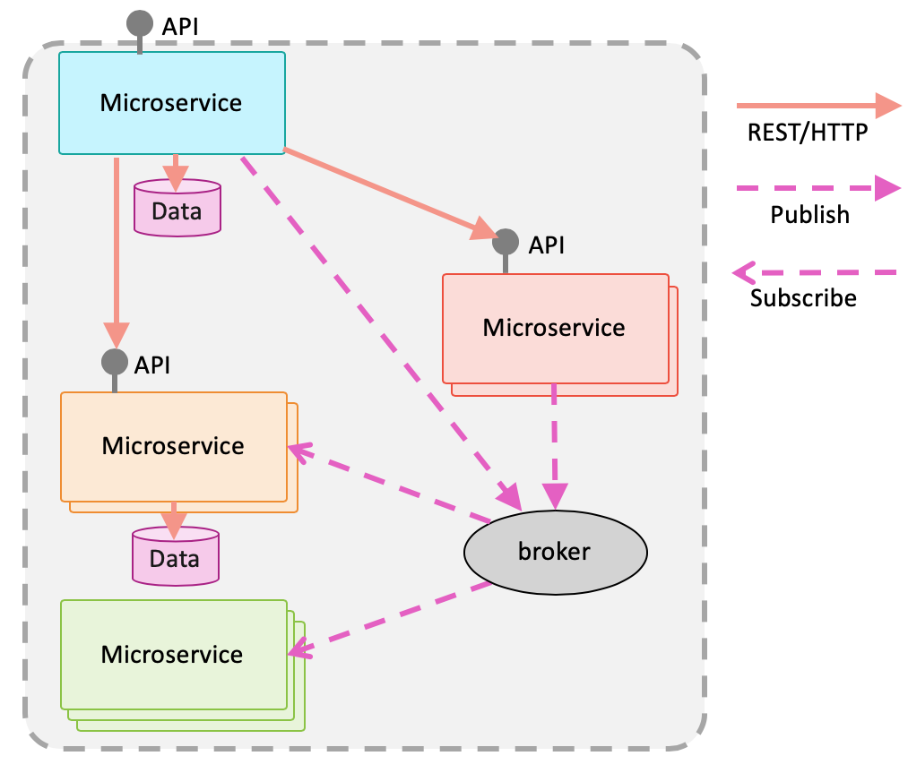

---

copyright:
  years: 2019
lastupdated: "2019-04-30"

---

{:new_window: target="_blank"}
{:shortdesc: .shortdesc}
{:screen: .screen}
{:codeblock: .codeblock}
{:pre: .pre}
{:tip: .tip}
{:note: .note}
{:important: .important}

# 클라우드 네이티브(cloud native)란 무엇입니까?
{: #overview}

클라우드 컴퓨팅 환경은 가상화된 공유 풀에서 리소스를 온디맨드로 할당하고 해제하는 동적인 환경입니다. 이러한 탄력적 환경은 기존의 온프레미스 데이터 센터에서 일반적으로 사용되는 초기 리소스 할당에 비해 보다 유연한 확장 옵션을 지원합니다.
{:shortdesc}

[Cloud Native Computing Foundation](https://github.com/cncf/foundation/blob/master/charter.md){: new_window} 에 따르면 클라우드 네이티브 시스템은 다음과 같은 속성을 가집니다.

- 애플리케이션 또는 프로세스는 소프트웨어 컨테이너에서 분리된 단위로 실행됩니다.
- 프로세스는 중앙 오케스트레이션 프로세스에 의해 관리되므로 리소스 활용률이 향상되고 유지보수 비용이 절감됩니다.
- 애플리케이션 또는 서비스(마이크로서비스)는 명시적으로 설명된 종속 항목과 느슨하게 결합됩니다.

이러한 속성은 비즈니스 가치를 제공하기 위해 함께 작동하는 독립적인 프로세스로 구성된 매우 동적인 시스템, 즉 분산 시스템을 설명합니다.

분산 컴퓨팅은 그 뿌리가 수십 년 전부터 이어온 개념입니다. [분산 컴퓨팅의 오류(Fallacies of Distributed Computing)](http://www.rgoarchitects.com/Files/fallacies.pdf){: new_window} 는 분산 시스템의 설계자 및 디자이너가 만든 다음과 같은 가정이 장기적으로 보면 틀린 것임을 증명합니다. 

* 네트워크는 신뢰할 수 있습니다.
* 네트워크는 안전합니다.
* 네트워크는 동질적입니다.
* 대기 시간이 0입니다.
* 대역폭은 무한대입니다.
* 토폴로지는 변하지 않습니다.
* 관리자가 한 명 있습니다.
* 전송 비용이 0입니다.

Kubernetes 및 Istio와 같은 클라우드 기술은 인프라 자체에서 이러한 문제를 해결하는 것을 목표로 합니다.

## 12가지 요소
{: #twelve-factors}

[12가지 요소 애플리케이션(twelve-factor application)](https://12factor.net){: new_window}  방법론은 Heroku의 개발자들에 의해 처음 제시되었습니다. 12가지 요소에 언급된 특성은 클라우드 제공자, 플랫폼 또는 언어에만 국한되지 않습니다. 이러한 요소는 클라우드 환경(특히 SaaS(Software as a Service) 애플리케이션)에서 잘 사용되는 이식 가능한 탄력적 애플리케이션에 대한 일련의 지침 또는 우수 사례를 나타냅니다. 12가지 요소가 다음 목록에 제공되어 있습니다.

1. 버전화된  코드 베이스(예: git 저장소)와 배치된 서비스 사이에는 일대일 연결이 있습니다. 동일한 코드 베이스가 여러 배치에 사용됩니다.
2. 서비스는 모든 종속 항목을 명시적으로 선언하며 시스템 수준 도구 또는 라이브러리의 존재 여부에 의존하지 않습니다.
3. 배치 환경마다 달라지는 구성은 환경, 특히 환경 변수에 저장됩니다.
4. 모든 지원 서비스는 첨부된 리소스로 처리되며, 이 리소스는 실행 환경에서 관리(첨부 및 분리)됩니다.
5. 전달 파이프라인은 빌드, 릴리스, 실행을 엄격하게 분리합니다.
6. 애플리케이션은 하나 이상의 상태 비저장(stateless) 프로세스로 배치됩니다. 특히, 임시 프로세스는 상태 비저장(stateless)이며 아무것도 공유하지 않습니다. 지속적 데이터는 적절한 지원 서비스에 저장됩니다.
7. 자체 포함 서비스는 지정된 포트에서 청취하여 다른 서비스에서도 사용할 수 있도록 합니다.
8. 개별 프로세스(수평적 확장)를 확장하여 동시성을 달성합니다.
9. 프로세스는 일회용입니다. 빠른 시작 및 정상 시스템 종료 동작으로 보다 강력하고 탄력적인 시스템이 됩니다.
10. 로컬 개발에서 프로덕션에 이르기까지 모든 환경은 가능한 한 유사합니다.
11. 애플리케이션은 예를 들어 `stdout` 및 `Stderr`에 쓰는 이벤트 스트림으로 로그를 생성하고, 실행 환경을 신뢰하여 스트림을 집계합니다.
12. 일회성 관리 태스크가 필요한 경우 해당 태스크는 소스 제어에 보관되고 애플리케이션과 함께 패키징되어 애플리케이션과 동일한 환경에서 실행됩니다.

고품질의 마이크로 서비스 환경을 달성하기 위해 이러한 요소를 엄격하게 따를 필요는 없지만, 이를 명심하면 지속적인 제공 환경에서 이식 가능 애플리케이션 또는 서비스를 빌드하고 유지보수할 수 있습니다.

## 마이크로서비스
{: #microservices}

*마이크로서비스(microservice)*는 각각 하나의 목적을 가진 소규모의 독립적인 아키텍처 컴포넌트들의 집합으로서, 일반적인 경량 API를 통해 통신합니다. 다음 간단한 예제에서 각 마이크로서비스는 교체 가능한 백업 서비스를 사용하여 데이터를 저장하고 메시지를 전달하는 12가지 요소 애플리케이션입니다.

{: caption="그림 1. 마이크로서비스 애플리케이션" caption-side="bottom"}

마이크로서비스는 독립적입니다. 민첩성은 마이크로서비스 아키텍처의 장점 중 하나이지만 다른 서비스를 방해하지 않고 서비스를 완전히 다시 작성할 수 있을 때만 존재합니다. 그런 일이 자주 발생하는 것 같지는 않지만, 이는 요건을 설명해 줍니다. API 경계가 없어지면 서비스에서 작업하는 팀이 구현을 발전시킬 수 있는 가장 유연한 환경을 제공할 수 있습니다. 이 특성은 폴리글롯 프로그래밍(polyglot programming)과 지속성을 가능하게 합니다.

마이크로서비스는 탄력적입니다. 애플리케이션 안정성은 개별 마이크로서비스가 장애에 대해 견고한지 여부에 따라 달라집니다. 이는 지원 인프라가 장애를 처리하는 기존 아키텍처와는 큰 차이점입니다. 각 서비스는 장애를 포함하고 적절한 대체 동작을 정의하여 업스트림 서비스를 보호하기 위해 격리 패턴(예: 회선 차단기 및 벌크 헤드)을 적용해야 합니다.

마이크로서비스는 상태 비저장(stateless), 임시 프로세스입니다. 이는 마이크로서비스가 상태를 가질 수 없다는 것과 다릅니다! 즉, 상태를 메모리가 아닌 Redis와 같은 외부 백업 클라우드 서비스에 저장해야 한다는 것을 의미합니다. 또한 빠른 시작 및 정상 시스템 종료 동작을 통해 로드에 대한 응답 또는 시스템 상태 유지보수를 위해 인스턴스를 생성하고 파괴하는 자동화된 환경에서 마이크로서비스가 제대로 작동합니다.

### "작은"의 의미
{: #small-microsvc}

마이크로서비스에 적용되는 "작은"이라는 단어의 사용은 기본적으로 목적에 초점이 맞춰져 있음을 의미합니다. 즉, 한 가지 일을 수행하고 그 한 가지 일을 잘 수행해야 한다는 의미입니다. 많은 설명이 개별 마이크로서비스 역할과 Unix 명령행의 연결된 명령 사이에서 평행을 이룹니다.

```
ls | grep 'service' | sort -r
```
{:pre}

이러한 Unix 명령은 각각 다른 태스크를 분명하게 수행하며, 프로그래밍 언어 또는 코드 양에 관계없이 해당 태스크를 함께 묶을 수 있습니다.

## 폴리글롯 애플리케이션: 작업에 적합한 도구 선택
{: #polyglot-apps}

폴리글롯(polyglot)은 마이크로서비스 기반 아키텍처의 자주 인용되는 장점입니다. 한편으로는 서비스가 제공하는 기능에 적합한 언어 또는 데이터 저장소를 선택하는 능력이 매우 강력할 수 있으며 많은 효율성을 가져올 수 있습니다. 반면에 불명확한 기술을 사용하면 장기적인 유지보수가 복잡해지고 팀 간의 개발자 이동을 억제할 수 있습니다. 

시간이 지남에 따라 새로운 기술로 목록을 확장하기 위해 정의된 정책을 사용하여 처음부터 선택할 수 있는 지원 기술 목록을 생성하여 둘 사이의 균형을 이루십시오. 유지보수성, 감사성, 데이터 보안과 같은 비기능 또는 규제 요구사항을 충족하는 동시에 민첩성을 유지하고 실험을 통해 혁신을 지원할 수 있습니다.

## REST 및 JSON
{: #rest-json}

폴리글롯 애플리케이션은 언어에 구애받지 않는 프로토콜에서만 가능합니다. REST 아키텍처 패턴은 온-더-와이어(on-the-wire) 데이터 표현과 서비스 구현을 구분하는 통일된 인터페이스를 생성하기 위한 가이드라인을 정의합니다.

JSON은 마이크로서비스 아키텍처에서 텍스트 기반 데이터를 위한 와이어 형식으로 개발되었으며 비교 단순성과 호환성으로 XML을 대체했습니다. 비교를 위해 다음 예제는 JSON으로 직원에 대한 데이터를 포함하고 있는 기본 레코드입니다.

```json
{
  "name": "Marley Cassin",
  "serial": 228264,
  "title": "Senior Software Engineer",
  "address": {
    "office": "501-B101",
    "street": "3858 Kuvalis Pass",
    "city": "East Craig",
    "state": "NC",
    "zip": "64519-8934"
  }
}
```
{: codeblock}

다음 예제는 XML로 되어 있는 동일한 직원 레코드입니다.

```xml
<person>
  <name>Marley Cassin</name>
  <serial>228264</serial>
  <title>Senior Software Engineer</title>
  <address>
    <office>501-B101</office>
    <street>3858 Kuvalis Pass</street>
    <city>East Craig</city>
    <state>NC</state>
    <zip>64519-8934</zip>
  </address>
</person>
```
{: codeblock}

JSON은 특성-값 쌍을 사용하여 숫자, 문자열, 배열 및 오브젝트와 같은 몇 가지 기본 유형에 대한 정보를 보존하는 간결한 구문으로 데이터 오브젝트를 나타냅니다. JSON과 XML은 모두 이전 예제에서 중첩된 주소 오브젝트를 명확하게 나타내지만, `serial` 요소의 유형을 확인하려면 연관된 XML 스키마가 필요합니다.   JSON에서는 구문을 통해 `serial`의 값이 문자열이 아닌 숫자임을 명확히 합니다.
