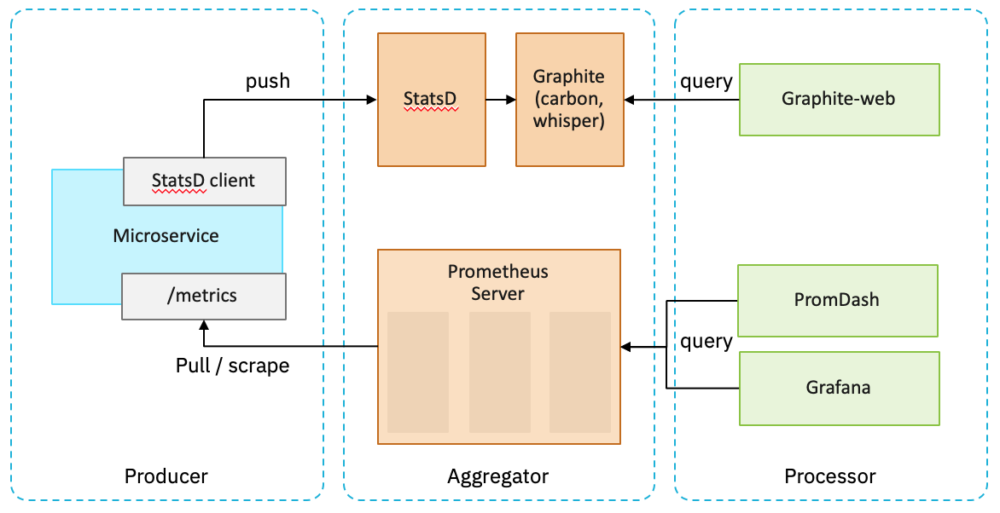

---

copyright:
  years: 2019
lastupdated: "2019-03-26"

---

{:new_window: target="_blank"}
{:shortdesc: .shortdesc}
{:screen: .screen}
{:codeblock: .codeblock}
{:pre: .pre}
{:tip: .tip}
{:note: .note}
{:important: .important}

# 메트릭
{: #metrics}

메트릭(metrics)은 키 값 쌍으로 캡처된 단순한 숫자 측정입니다. 일부 메트릭은 증분 카운터이고, 다른 메트릭은 마지막 분 내에 수집된 모든 값의 합계 또는 마지막 분 동안의 평균 경과 시간과 같은 집계 작업을 수행합니다. 일부 메트릭은 마지막으로 관찰된 값을 리턴하는 단순한 게이지일 뿐입니다. 메트릭을 캡처하고 처리하는 것은 잠재적인 문제를 식별하고 더 심각한 문제가 발생하기 전에 대응하는 데 도움이 될 수 있습니다.
{:shortdesc}

분산 시스템에서 메트릭스에 대해 이야기할 때 세 가지 일반적인 요소는 생산자, 집계기 및 프로세서입니다. 그래픽 대시보드에 표시하기 위해 수집된 메트릭을 처리하는 Grafanana와 함께 집계기로 Prometheus를 사용하거나, Graphite와 함께 StatsD를 사용하는 등 이러한 요소의 상당히 일반적인 조합이 있습니다. 

{: caption="그림 1. 분산 시스템 메트릭의 3가지 요소" caption-side="bottom"}

물론 생산자는 애플리케이션 그 자체입니다. 경우에 따라 애플리케이션이 메트릭 생성에 직접 관여하는 경우도 있습니다. 다른 경우에는 에이전트 또는 기타 인프라에서 애플리케이션을 수동적으로 관찰하거나 적극적으로 계측하여 대신 메트릭을 생성할 수 있습니다. 다음에 수행되는 작업은 집계기에 따라 달라집니다. 

메트릭은 "푸시(push)" 또는 "풀(pull)" 메커니즘을 통해 생산자에서 집계기로 전송됩니다. StatsD와 같은 일부 집계기는 애플리케이션(또는 애플리케이션을 대신하는 에이전트)이 데이터를 전송하기 위해 집계기에 연결될 것으로 예상합니다. 따라서 측정해야 하는 모든 애플리케이션 프로세스에 집계기가 분배되도록 연결 정보가 필요합니다. Prometheus와 같은 다른 집계기는 알려진 엔드포인트에 정기적으로 연결하여 메트릭 데이터를 수집(또는 스크레이핑)합니다. 이를 위해서는 생산자가 스크레이핑할 수 있는 엔드포인트를 정의 및 제공하고 엔드포인트가 있는 위치를 집계기에 알려야 합니다.  Kubernetes와 함께 사용하는 경우 Prometheus는 서비스 어노테이션을 기반으로 엔드포인트를 검색할 수 있습니다. 

마지막으로 프로세서는 집계된 모든 데이터를 활용하는 것입니다. 앞서 언급한 바와 같이 Grafana와 같은 서비스는 대시보드를 사용하는 시각화를 위해 집계된 메트릭을 처리합니다. Grafana는 대시보드와는 독립적으로 저장되고 평가되는 규칙에 따라 경보를 지원합니다. 

## Kubernetes에서 Prometheus 엔드포인트의 자동 검색
{: #prometheus-kubernetes}

풀 기반(pull-based) 모델은 자체 에코시스템을 만들었습니다. Sysdig와 같은 다른 집계기도 Prometheus 엔드포인트에서 메트릭 데이터를 스크레이핑할 수 있습니다. 이는 일부 시스템이 Prometheus 서버를 사용하지 않고 Prometheus 메트릭을 사용한다는 것을 의미할 수 있습니다. 

Kubernetes 환경에서는 Prometheus 엔드포인트 검색에 어노테이션을 사용합니다. 예를 들어 포트 8080의 HTTP를 통해 `/metrics` 엔드포인트를 제공하는 서비스는 서비스 정의에 다음과 같은 어노테이션을 추가합니다. 

```yaml
apiVersion: v1
kind: Service
metadata:
  name: ...
  annotations:
    prometheus.io/scrape: 'true'
    prometheus.io/scheme: http
    prometheus.io/path: /metrics
    prometheus.io/port: "8080"
  ...
```
{: codeblock}

모든 Prometheus 호환 가능 집계기는 엔드포인트에서 필터링하여 Kubernetes API를 사용하는 이러한 엔드포인트를 검색할 수 있습니다. 

## 애플리케이션 대 플랫폼 메트릭
{: #app-platform-metrics}

메트릭을 수집하려면 생각을 해야 합니다. 어떤 데이터 포인트를 수집해야 합니까? 클라우드 네이티브 애플리케이션을 고려할 때 메트릭을 두 개의 카테고리 즉, 애플리케이션 및 플랫폼으로 광범위하게 나눌 수 있습니다.

* 애플리케이션 메트릭은 애플리케이션 도메인 엔티티에 초점을 맞춥니다. 예를 들어, 최근 5분 동안 완료한 로그인 수는 몇 개입니까?  현재 연결된 사용자 수는 몇 명입니까? 얼마나 많은 거래가 마지막 초에 수행되었습니까? 애플리케이션별 메트릭을 수집하려면 정보를 수집하고 공개하기 위해 사용자 정의 코드가 필요합니다. 대부분의 언어에는 사용자 정의 메트릭 추가를 간소화할 수 있는 메트릭 라이브러리가 있습니다.
* 이와 대조적으로, 플랫폼 메트릭은 도메인 엔티티를 호스팅합니다. 예를 들어, 서비스를 호출하는 데 시간이 얼마나 걸립니까? 이 데이터베이스 조회에 소요되는 시간은 얼마입니까? 플랫폼 메트릭은 시스템을 통해 트래픽과 작업이 흐르는 방식에 맞게 조정되며 애플리케이션 변경 없이 측정될 수 있는 경우가 많습니다. 또한 일부 애플리케이션 프레임워크는 쿼리 실행 시간과 같은 이러한 문제를 측정하는 데 기본적으로 지원됩니다. 

이러한 카테고리만으로는 측정해야 할 항목을 결정하는 데 충분하지 않습니다. 분산 시스템에는 메트릭스를 생성하는 많은 요소가 있습니다. 방대한 메트릭 풀을 주목해야 할 몇 가지 필수 항목으로 추출하려는 몇 가지 잘 알려진 방법이 있습니다. 

* [4가지 황금 신호](https://landing.google.com/sre/sre-book/chapters/monitoring-distributed-systems/#xref_monitoring_golden-signals){: new_window} 는 분산 시스템을 모니터할 때 서비스 레벨 관찰을 위해 Google 사이트 신뢰도 엔지니어링(SRE) 팀에서 식별한 필수 메트릭입니다. 그들은 "사용자 대면 시스템의 4가지 메트릭만 측정할 수 있다면 이 4가지 메트릭스에 초점을 맞추십시오."라고 말합니다. 네 가지 메트릭은 대기 시간, 트래픽, 오류 및 포화입니다. 
* [사용률 포화 및 오류(USE) 방법](http://www.brendangregg.com/usemethod.html){: new_window} 은 시스템의 성능을 분석하기 위한 비상 체크리스트로 설계되었습니다. USE 방법은 "모든 리소스에 대해 사용률, 포화 및 오류를 확인하십시오"라는 문장으로 요약할 수 있습니다. 이 경우 리소스는 CPU 또는 디스크와 같은 제한사항이 있는 물리적 또는 논리적 리소스입니다. 각 유한 리소스에 대해 사용률, 포화 및 오류를 측정합니다.  
* [RED 방법](https://thenewstack.io/monitoring-microservices-red-method/){: new_window} 은 아키텍처의 모든 마이크로서비스에 대해 측정해야 하는 세 가지 핵심 메트릭을 정의하는 4가지 황금 신호에서 파생된 것입니다. 이 방법은 요청 중심적이며, 특히 대부분 클라우드 네이티브 애플리케이션의 설계 및 아키텍처에 적합합니다. 메트릭은 비율, 오류 및 지속 시간입니다.  

예를 들어, 이러한 방법에는 몇 가지 일반적인 요소가 있습니다. 모든 요소가 오류 비율을 추적합니다. 하지만 주목할 만한 차이점도 있습니다. USE 방법은 인프라 메트릭(활용/포화)에 초점을 맞춥니다. 클라우드 네이티브 환경은 물리적(또는 가상) 하드웨어를 보다 효율적으로 사용하도록 설계되었습니다. 이러한 인프라 측정에서는 시스템이 로드를 적절하게 처리하고 있는지 여부를 확인합니다. RED 방법은 전적으로 요청 메트릭(대기 시간/지속 시간, 트래픽/비율)에 초점을 맞춥니다. 이 메트릭은 인프라(네트워크 문제) 또는 애플리케이션(오류 구성, 교착 상태, 반복적인 서비스 오류 등)과 함께 사용할 경우 특히 그렇습니다. 황금 신호는 인프라와 요청 메트릭을 모두 포괄적인 보기로 통합하는 데 사용됩니다.

## 메트릭 정의
{: #defining-metrics}

단일 서비스에서 수집된 모니터링 메트릭은 리소스 활용에 대한 아이디어를 제공할 수 있지만 수평적 확장 또는 다중 영역 배치로 인해 서비스의 인스턴스가 여러 개 있는 경우 이러한 메트릭을 구분하여, 들어오는 유사한 대량 데이터 내에서 문제를 격리해야 합니다. 이것은 결국 이름 지정으로 귀결됩니다. 경우에 따라 사용 중인 메트릭 시스템에 메트릭의 구조가 적용될 수 있습니다. 예를 들어 Prometheus는 `namespace_subsystem_name`과 같은 항목을 권장하고 다른 프로그램은 `namespace.subsystem.targetNoun.actioned`를 권장합니다. 

예를 들어, 주식 거래 애플리케이션이 수행한 "거래"의 수를 추적하고자 할 경우, `stock.trades`라는 특성에 이를 캡처할 수 있습니다. 인스턴스를 구분하려면 인스턴스 ID `<instanceid>.stock.trades`로 특성을 접두부 처리할 수 있습니다. 이는 `*.stock.trades`를 사용하여 개별 인스턴스 값과 집계 데이터 콜렉션을 지원합니다. 하지만 여러 데이터 센터에 배치하여 메트릭을 분석하고자 할 때 어떤 일이 발생할까요? 이름을 `<datacenter>.<instanceid>.stock.trades`로 변경할 수 있지만 `*.stock.trades`의 이전 와일드카드를 사용하는 보고가 중단됩니다. 대신 `*.*.stock.trades`를 사용해야 합니다.  

주의하지 않고 계층적으로 이름 지정된 특성만 사용하면 취약한 와일드카드 패턴이 이름 지정 전략의 임의 구조에 연결되어 애플리케이션이 제대로 작동하는지 확인하는 데 필요한 정보를 관찰하는 데 도움이 되지 않을 수 있습니다. 

차원 데이터를 지원하는 메트릭 시스템을 사용하면 추가 식별 레이블 또는 태그를 메트릭 데이터와 연관시킬 수 있습니다. 와일드카드 및 이름 지정 규칙에 의존하지 않고 이러한 추가 차원을 사용하여 수집된 메트릭을 필터링, 그룹화 또는 분석할 수 있습니다. 일반적인 레이블에는 엔드포인트 또는 서비스 이름, 데이터 센터, 응답 코드, 호스팅 환경(프로덕션/스테이징/개발/테스트) 또는 런타임 식별자(Java 버전, 앱 서버 정보)가 포함됩니다. 

동일한 주식 거래 예제를 사용하여 `stock.trades` 메트릭은 다음 몇 개의 레이블에 연관됩니다. `{ instanceid=..., datacenter=... }`. 여기서 와일드카드를 사용하지 않고 집계된 값을 `instanceid` 또는 `datacenter`별로 필터링하거나 그룹화할 수 있습니다. 이름 지정된 메트릭(`stock.trades`)과 연관된 레이블 사이에 균형이 있습니다(`<datacenter>.<instanceid>.stock.trades`의 계층적 예제와 비교). 각 메트릭은 의미 있는 데이터를 캡처해야 하며, 해당되는 경우 명확히 하기 위해 레이블을 추가합니다. 

또한 레이블을 정의할 때 주의해야 합니다. 예를 들어, Prometheus에서는 키-값 레이블 쌍의 모든 고유 조합을 별도의 시계열로 처리합니다. 올바른 조회 동작 및 제한된 데이터 콜렉션을 보장하는 가장 좋은 방법은 허용된 값의 수가 한정된 레이블을 사용하는 것입니다. 예를 들어 오류 수를 세는 메트릭을 사용하는 경우 리턴 코드를 레이블로 사용할 수 있습니다. 여기서 값은 적절한 집합(401, 404, 409, 500,...  )내에 있습니다. 그러나 실패한 URL에 대한 레이블은 제한되지 않은 집합(유효하지 않은 것을 포함하여 어떠한 이유로 실패한 모든 요청 URL)이므로 원하지 않을 것입니다. 

이름 지정 메트릭 및 레이블의 우수 사례에 대한 자세한 정보는 [메트릭 및 레이블 이름 지정](https://prometheus.io/docs/practices/naming/){: new_window} 을 참조하십시오. 

## 추가 고려사항
{: #metrics-considerations}

메트릭을 수집할 때는 실패 경로가 성공 경로와 크게 다른 경우가 많습니다. 예를 들어, 실패에 제한시간 초과 및 스택 추적 콜렉션이 포함된 경우 HTTP 리소스에 대한 오류 응답 시간이 성공한 응답보다 훨씬 더 오래 걸릴 수 있습니다. 성공적인 요청과 별도로 오류 경로를 계수하고 처리하십시오. 

분산 시스템은 특정 측정에서 자연스러운 변동을 가집니다. 시작 또는 종료 중에 프로세스에 요청이 전달될 수 있으므로 오류가 발생하는 것은 정상입니다. 이 자연적 변동이 유효한 범위를 초과하기 시작할 때 포착할 원시 데이터를 필터링합니다. 예를 들어 메트릭을 버킷으로 분할합니다. 요청 기간을 슬라이딩 시간 창에서 관찰된 '가장 작음/가장 빠름', '중간/정상', '가장 김/가장 큼'과 같은 카테고리로 분류합니다. 요청 기간이 "가장 김/가장 큼" 버킷에 지속적으로 도달하는 경우 문제를 식별할 수 있습니다. 일반적으로 히스토그램 또는 요약 메트릭은 이러한 종류의 데이터에 사용됩니다. 자세한 정보는 [히스토그램 및 요약](https://prometheus.io/docs/practices/histograms/){: new_window} 을 참조하십시오. 

애플리케이션 개발자로서 애플리케이션 또는 서비스가 조직 전체 규칙을 따르는 이름과 레이블이 포함된 메트릭을 생성하여 비즈니스 중심인 엔드 투 엔드 경로에 초점을 맞춘 모니터링 작업을 지원해야 합니다. 자세한 정보는 [분산 시스템 모니터링](https://landing.google.com/sre/sre-book/chapters/monitoring-distributed-systems){: new_window} 을 참조하십시오. 
