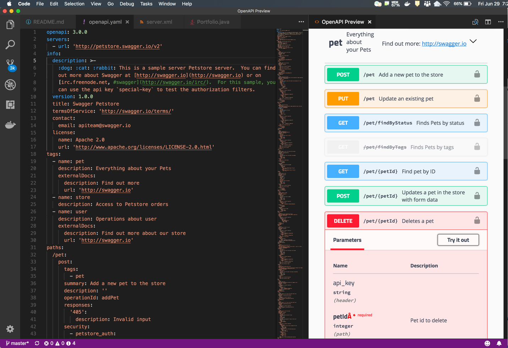

---

copyright:
  years: 2019
lastupdated: "2019-03-26"

---

{:new_window: target="_blank"}
{:shortdesc: .shortdesc}
{:screen: .screen}
{:codeblock: .codeblock}
{:pre: .pre}
{:tip: .tip}
{:note: .note}
{:important: .important}

# 创建 RESTful 微服务
{: #rest-api}

云本机应用程序不管是否位于微服务体系结构中，都可生成并使用 API。有些 API 被视为内部或专用 API，有些被视为外部 API。
{:shortdesc}

内部 API 仅在通过防火墙保护的环境中使用，供后端服务相互通信。外部 API 为使用者提供统一的入口点，并且通常由 {{site.data.keyword.apiconnect_long}} 等工具进行**管理**，这可能会施加速率限制或其他使用约束。例如，[GitHub Developer API](https://developer.github.com/v3/){: new_window}  就是这种 API。它提供了一个统一的 API，以一致的方式使用 HTTP 动词和返回码、分页行为等，而无需公开内部实现详细信息。此 API 既可以由单一应用程序进行支持，也可以由一组微服务进行支持；该详细信息不会向使用者公开，因此 GitHub 能自由地根据需要来逐渐发展其内部系统。

## RESTful API 的最佳实践
{: #bps-apis}

REST API 应该使用标准 HTTP 动词来表示创建、检索、更新和删除 (CRUD) 操作，其中要特别注意的是操作是否为幂等（可安全重试多次）。

* POST 操作可用于创建或更新资源。POST 操作不能反复调用。例如，如果一个 POST 请求用于创建资源，随后多次调用了该请求，那么会在每次调用后，会相应创建一个新的唯一资源。
* GET 操作必须能够反复调用，并且不能导致副作用。GET 操作只应该用于检索信息。包含查询参数的 GET 请求不得用于更改或更新信息。请改为使用 POST、PUT 或 PATCH 操作。
* PUT 操作可用于更新资源。PUT 操作通常包含要更新的资源的完整副本，因此可以多次进行调用。
* PATCH 操作允许对资源进行部分更新。PATCH 操作可以根据增量指定方式来反复调用，然后将其应用于资源。例如，如果 PATCH 操作指示某个值应该从 A 更改为 B，那么可以重复调用该操作。如果多次调用该操作，但该值已经是 B，那么不会有任何效果。
* DELETE 操作可以多次调用，尽管一个资源只能删除一次。但是，返回码会有所不同，因为第一个操作成功（返回 `200` 或 `204`），而后续调用找不到该资源（返回 `404` 或 `410`）。

### 机器友好的描述性结果
{: #rest-results}

鉴于 API 是由软件而不是人类来调用，因此应该谨慎操作，以尽可能最有效且高效的方式向调用者传达信息。

使用相关且有用的 HTTP 状态码，如下表中所述： 

|HTTP 错误代码|使用指导信息|
|-----------------|----------------|
|`200（正常）`|一切正常且有数据要返回时使用|
|`204（无内容）`|一切正常但没有响应数据时使用|
|`201（已创建）`|用于导致创建资源的 POST 请求，无论是否存在响应主体|
|`409（冲突）`|在并发更改发生冲突时使用|
|`400（错误的请求）`|在参数格式不正确时使用|

有关更多信息，请参阅 [Response status codes](https://tools.ietf.org/html/rfc7231#section-6){: new_window} 。 

您还应该考虑要在响应中返回哪些数据，以实现高效通信。例如，使用 POST 请求创建资源时，响应应该在 Location 头中包含新创建的资源的位置。创建的资源通常还会包含在响应主体中，这样就无需使用额外的 GET 请求来访存所创建的资源。对于 PUT 和 PATCH 请求也同样如此。

### RESTful 资源 URI
{: #rest-uris}

对于 RESTful 资源 URI 的某些方面，有各种不同的观点。但通常意见一致的是：资源应该是名词，而不是动词，并且端点应该是复数。这为 CRUD 操作提供了明确的结构：

* `POST /accounts`：创建新帐户。
* `GET /accounts`：检索帐户列表。
* `GET /accounts/16`：检索特定帐户。
* `PUT /accounts/16`：更新特定帐户。
* `PATCH /accounts/16`：更新特定帐户。
* `DELETE /accounts/16`：删除特定帐户。

关系使用分层 URI 来建模（例如，`/accounts/16/credentials`），用于管理与帐户关联的凭证。

在操作与不适合此通常结构的资源相关联时应该发生什么情况，对此的意见不太统一。管理这些操作不存在唯一正确的方法：按最适合 API 使用者的方法行事即可。

### 稳健性和 RESTful API
{: #robust-api}

[Robustness Principle](https://tools.ietf.org/html/rfc1122#page-12){: new_window}  提供了最佳指导信息：“Be liberal in what you accept, and conservative in what you send”（对所接受的内容尽量包容，而对所发送的内容尽量审慎）。假定 API 会随着时间的推移而逐渐发展，并且能容忍您不了解的数据。

#### 生成 API
{: #robust-producer}

向外部客户机提供 API 后，在接受请求和返回响应时必须执行两个操作。 

* 接受未知属性作为请求的一部分。
    > 如果服务调用 API 时使用了不必要的属性，只要将这些值丢弃即可。在此场景中返回错误可能会导致不必要的失败，从而对最终用户产生负面影响。
* 仅返回使用者所需的属性。
    > 避免公开内部服务详细信息。仅将使用者需要的属性作为 API 的一部分公开。

#### 使用 API
{: #robust-consumer}

仅针对需要的变量或属性验证请求。

    > 不要提供什么变量都进行验证。如果不打算在请求中使用这些变量，那么不要因为提供了这些变量就一定要进行验证。

接受未知属性作为响应的一部分。

    > 收到意外变量时，不发出异常。只要响应包含所需的信息，随响应一起收到的其他内容都无关紧要。

这些准则对于 Java 等强类型语言特别重要，在这类语言中，经常会间接执行 JSON 序列化和反序列化，例如，通过 Jackson 库或 JSON-P/JSON-B。请寻找允许您指定更宽容行为（如忽略未知属性），或者允许定义或过滤哪些属性应该执行序列化的语言机制。

### 版本控制 RESTful API
{: #version-api}

微服务的一大优点是能够允许服务独立发展。考虑到微服务会调用其他服务，因此这种独立性伴随着一个极大的问题：您无法促使在 API 中进行重大更改。

如果遵循稳健性原则，那么可能要过很长时间才需要进行重大更改。当需要重大更改的最终时刻来临时，您可以选择另行构建一个不同的服务，并逐步引退原始服务。

如果确实需要对现有服务进行重大 API 更改，请决定如何管理这些更改：服务是否将处理该 API 的所有版本？您是否要维护服务的各个独立版本以支持 API 的每个版本？或者，服务是否仅支持 API 的最新版本，并依赖于其他自适应层在新旧 API 之间转换？

在确定如何管理更改后，接下来要解决的问题是如何在 API 中反映版本，这就容易多了。通常有三种方法可对 REST 资源进行版本控制：

* 在 URI 路径中包含版本。
* 在 HTTP Accept 头中包含版本，并依赖于内容协商。
* 使用定制请求头。

#### 在 URI 路径中包含版本
{: #version-path}

指定版本的最简单方法是将其包含在 URI 的路径中。此方法具有以下优点：版本显而易见，在应用程序中构建服务时很容易实现，并且与多种 API 浏览工具（如 Swagger）和命令行工具（如 `curl` 等）兼容。

如果要将版本包含在 URI 的路径中，那么版本应该应用于整个应用程序，例如 `/api/v1/accounts`，而不是 `/api/accounts/v1`。超媒体即应用程序状态引擎 (HATEOAS) 是向 API 使用者提供 URI 的一种方法，让使用者无需自行负责构造 URI。例如，出于此原因，GitHub 会在响应中提供[超媒体 URL ](https://developer.github.com/v3/\#hypermedia){: new_window}。如果不同的后端服务可以在其 URI 中具有互不相同的版本，那么 HATEOAS 将很难实现，甚至可能完全不可行。

#### 修改 Accept 头以包含版本
{: #version-accept}

Accept 头是定义版本的明显位置，但也是最难进行测试的位置之一。Accept 头还是常用于功能切换的位置。指定 HTTP 头需要更详细的 API 调用。

#### 添加定制请求头
{: #version-custom}

可以添加定制请求头来指示 API 版本。与 Accept 头一样，还可以使用定制头将流量路由到特定后端实例。使用此方法时，您将遇到与使用 Accept 头方法时相同的易用性问题，使用者需要了解有关此头的其他需求。

有关更多信息，请参阅 [Your API versioning is wrong, which is why I decided to do it 3 different wrong ways](https://www.troyhunt.com/your-api-versioning-is-wrong-which-is/){: new_window} 。

## 创建和生成 API
{: #create-api}

[OpenAPI V3](https://github.com/OAI/OpenAPI-Specification/blob/master/versions/3.0.2.md){: new_window}  是 RESTful 服务的官方规范，由 [OpenAPI Initiative](https://www.openapis.org/){: new_window}  进行管理；OpenAPI Initiative 是 Linux Foundation 旗下的一个公司联盟。

可以使用以下任一方法来创建 API：

  * 从 OpenAPI 定义开始（自顶向下）：在此方法中，首先通过与语言无关的格式（通常是 YAML）创建 OpenAPI 定义。然后，使用代码生成器来创建框架，并在其中构建服务实现。此模式通常由具有中央 API 设计团队的公司采用，并允许进行开发和测试以并行发展。
  * 从代码开始（自底向上）：代码是 API 定义的源。此方法非常适合具有试验性方面的新应用程序，因为随着您更好地了解服务需要执行的操作，API 定义会逐渐发展。此外，此方法在一些语言中的表现要优于其他语言，因为它依赖于通过您的代码生成 OpenAPI 定义的工具。例如，Java 能够完美地支持从基于注释的 REST 框架生成 OpenAPI 文档。

在任一情况下，使用 OpenAPI 定义都可帮助识别 API 不一致或很难从使用者角度理解的方面。此外，已发布或已进行版本控制的 OpenAPI 定义可由构建工具使用，以帮助标记会影响使用者的重大更改。

### 通过 OpenAPI 定义创建 API
{: #openapi-first}

您可以在所选择的任何工具中编写 OpenAPI YAML 文件。但是，使用纯文本编辑器可能很容易出错。有些编辑器具有对 YAML 的基本支持，有些编辑器则可能有其他扩展来支持 OpenAPI 定义。例如，可以使用 Visual Studio Code 扩展（如 [Swagger Viewer](https://marketplace.visualstudio.com/items?itemName=Arjun.swagger-viewer){: new_window}  或 [OpenAPI 预览](https://marketplace.visualstudio.com/items?itemName=zoellner.openapi-preview){: new_window} ）根据指定的规范版本来验证 OpenAPI 定义，并在预览窗格中呈现 Web 视图：

{: caption="图 1. OpenAPI 预览" caption-side="bottom"} 

另外还有多种基于浏览器的实时解析编辑器，您可以联机或本地使用这些编辑器。一些示例包括：

* [OpenAPI-GUI 项目](https://github.com/Mermade/openapi-gui){: new_window}  同时支持 OpenAPI V2 和 V3 规范，并且可以将 OpenAPI V2 定义迁移到 V3。
* [Swagger Editor from SmartBear](https://editor.swagger.io){: new_window}  也同时支持 OpenAPI V2 和 V3。
* [{{site.data.keyword.apiconnect_short}}](https://cloud.ibm.com/catalog/services/api-connect){: new_window}  提供了一组用于 API 建模和创建操作的编辑器和工具。

### 生成 API 实现
{: #code-first}

可以使用开放式源代码 [OpenAPI 生成器](https://github.com/OpenAPITools/openapi-generator){: new_window} ，通过 OpenAPI 定义来创建用于服务实现的框架项目。您可以在命令行中指定框架的语言或架构。例如，要为使用通用 JAX-RS 方法注释的样本 PetStore API 创建 Java 项目，需要指定以下内容：

```bash
openapi-generator generate -g jaxrs-cxf-cdi -i ./petstore.yaml -o petstore --api-package=com.ibm.petstore
```
{: pre}

